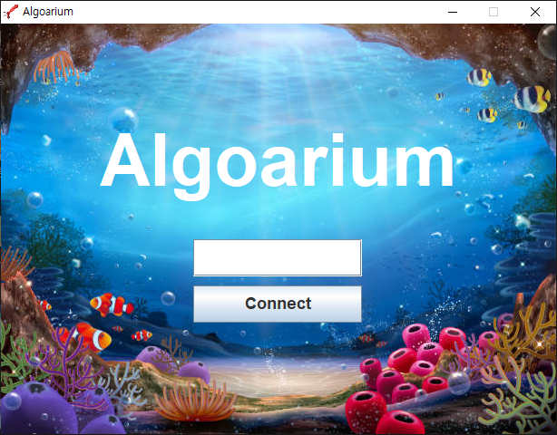
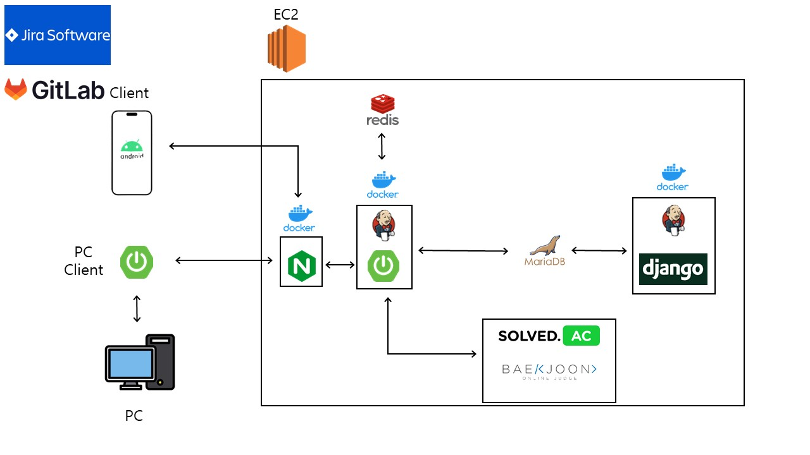

# 🧳 알고알리움


## == Contents ==

1. [개요](#1-개요)
2. [프로젝트 소개](#2-프로젝트-소개)
3. [주요기능](#3-주요-기능)
4. [프로젝트 실행방법](#4-프로젝트-실행-방법)
5. [기술스택](#5-기술-스택)
   1. [Mobile](#51-front-end)
   2. [Back-End](#52-back-end)
6. [프로젝트 구조도](#6-프로젝트-구조도)
7. [Design](#7-design)
8. [TEAM](#8-team)

<br>
<br>

## 1. 개요

- 개발 기간: 2023.10.05 ~ 2023.10.05

- 삼성 청년 소프트웨어 아카데미(SSAFY) 빅데이터 추천 프로젝트
  
  `#빅데이터` `#알고리즘문제추천`

<br>
<br>

## 2. 프로젝트 소개

🌊 Naming : 알고리즘문제를 의미하는 알고와 알려준다라는 의미를 가진 알리움을 결합. 

- 알고리즘 문제를 사용자에 실력에 맞추어 (강점 문제, 약점 문제, 비슷한 사용자가 푼 문제)로 나누어 알고리즘 문제를 추천해주는 빅데이터 기반 추천 프로젝트

<br>

> 강점 문제란?

- 사용자의 능력에 비해 많이 푼 유형의 문제로, 능력 대비 어려운 문제를 추천

> 약점 문제란?

- 사용자의 능력에 비해 적게 푼 유형의 문제로, 능력 대비 쉬운 문제를 추천

> 비슷한 사용자가 푼 문제란?

- 사용자의 능력과 비슷한 다른 사용자들이 많이 푼 문제를 추천

<br>
<br>

## 3. 주요 기능

### 3.1. 시즌 별 티어 제도


- 8가지의 티어를 두어 시즌 내 특정 포인트 달성 시 승급
- 매 시즌 포인트 초기화
- 이전 시즌 티어는 상징으로 기록됨

<br>

### 3.2. 랭킹 제도


- 포인트를 기반으로 전체 사용자의 랭킹을 보여줌

<br>

### 3.3. 스탯 제도


- 사용자에게 5개의 스탯 (지혜, 생명, 힘, 운, 카리스마)을 할당
- 지혜 : 푼 문제 수
- 생명 : 최대 연속 문제풀이 횟수
- 힘 : rating 변화
- 운 : 별조각 갯수
- 카리스마 : 정답자 수가 낮은 문제를 맞출 경우

<br>

### 3.4 알고리즘 문제 추천


- 알고리즘 문제를 사용자에 실력에 맞추어 (강점 문제, 약점 문제, 비슷한 사용자가 푼 문제)로 나누어 알고리즘 문제를 추천

- 해당 문제를 찜할 수 있고 메모 가능

<br>

### 3.5 PC에 문제 띄우기



- PC 어플리케이션을 실행하고 모바일과 연동 한 후 모바일 문제를 클릭하면 해당 PC에 웹페이지를 띄움
- 어플리케이션은 백그라운드에서도 실행 가능

<br>
<br>

## 4. 프로젝트 실행 방법

### 4.1. client 실행

1. **클라이언트 다운로드**

```bash
$ http://j9d204.p.ssafy.io:8090/
```

2. **인증코드 입력**

<br>

### 4.2. server 실행

1. **원격 저장소 복제**

```bash
$ https://lab.ssafy.com/s09-bigdata-recom-sub2/S09P22D204.git
```

2. **프로젝트 폴더로 이동**

```bash
$ cd BE/algoarium
```

3. **main 메서드 실행하기**

<br>
<br>

## 5. 기술 스택

### 5.1. Front-End


<br>

### 5.2. Back-End

#### API 서버


#### 추천 시스템 서버


#### DB


### Deployment


### Communication


<br>
<br>

## 6. 프로젝트 구조도

```
└─📂backend
    └─📁 algo_MR
    └─📁 algoarium
    └─📁 socket
└─📂frontend
```

<details>
<summary>Front-End</summary>
<div markdown="1">

```
─app
│  └─src
│      ├─androidTest
│      │  └─java
│      │      └─com
│      │          └─d204
│      │              └─algo
│      ├─main
│      │  ├─java
│      │  │  └─com
│      │  │      └─d204
│      │  │          └─algo
│      │  │              ├─base
│      │  │              ├─cache
│      │  │              │  ├─dao
│      │  │              │  ├─mapper
│      │  │              │  └─model
│      │  │              ├─data
│      │  │              │  ├─api
│      │  │              │  ├─model
│      │  │              │  ├─repository
│      │  │              │  │  ├─cache
│      │  │              │  │  ├─datasource
│      │  │              │  │  └─remote
│      │  │              │  └─source
│      │  │              │      ├─cache
│      │  │              │      ├─datasource
│      │  │              │      └─remote
│      │  │              ├─di
│      │  │              ├─presentation
│      │  │              │  ├─utils
│      │  │              │  └─viewmodel
│      │  │              ├─remote
│      │  │              │  ├─api
│      │  │              │  ├─mapper
│      │  │              │  └─model
│      │  │              └─ui
│      │  │                  ├─adapter
│      │  │                  ├─custom
│      │  │                  ├─extension
│      │  │                  ├─home
│      │  │                  ├─oauth
│      │  │                  ├─promote
│      │  │                  ├─ranking
│      │  │                  ├─recommend
│      │  │                  └─status
│      │  └─res
│      │      ├─anim
│      │      ├─animator
│      │      ├─drawable
│      │      ├─drawable-night
│      │      ├─drawable-v24
│      │      ├─font
│      │      ├─layout
│      │      ├─mipmap-anydpi-v26
│      │      ├─mipmap-hdpi
│      │      ├─mipmap-mdpi
│      │      ├─mipmap-xhdpi
│      │      ├─mipmap-xxhdpi
│      │      ├─mipmap-xxxhdpi
│      │      ├─navigation
│      │      ├─raw
│      │      ├─values
│      │      ├─values-night
│      │      └─xml
│      └─test
│          └─java
│              └─com
│                  └─d204
│                      └─algo
└─gradle
    └─wrapper
```

</div>
</details>

<details>
<summary>Back-End</summary>
<div markdown="1">

```
─algoarium
│  ├─.gradle
│  │  ├─8.2.1
│  │  │  ├─checksums
│  │  │  ├─dependencies-accessors
│  │  │  ├─executionHistory
│  │  │  ├─fileChanges
│  │  │  ├─fileHashes
│  │  │  └─vcsMetadata
│  │  ├─buildOutputCleanup
│  │  └─vcs-1
│  ├─.idea
│  ├─build
│  │  ├─classes
│  │  │  └─java
│  │  │      ├─main
│  │  │      │  └─com
│  │  │      │      └─ssafy
│  │  │      │          └─algoarium
│  │  │      │              ├─BaekjoonUser
│  │  │      │              ├─DummyData
│  │  │      │              ├─KakaoLogin
│  │  │      │              ├─Problem
│  │  │      │              ├─ProblemLike
│  │  │      │              ├─ProblemTag
│  │  │      │              ├─RecommendProblem
│  │  │      │              ├─Redis
│  │  │      │              ├─Season
│  │  │      │              ├─SolvedProblemHistory
│  │  │      │              ├─Tag
│  │  │      │              ├─User
│  │  │      │              ├─UserRanking
│  │  │      │              ├─UserStatus
│  │  │      │              └─WebSocket
│  │  │      └─test
│  │  │          └─com
│  │  │              └─ssafy
│  │  │                  └─algoarium
│  │  ├─generated
│  │  │  └─sources
│  │  │      ├─annotationProcessor
│  │  │      │  └─java
│  │  │      │      ├─main
│  │  │      │      └─test
│  │  │      └─headers
│  │  │          └─java
│  │  │              ├─main
│  │  │              └─test
│  │  ├─libs
│  │  ├─reports
│  │  │  └─tests
│  │  │      └─test
│  │  │          ├─classes
│  │  │          ├─css
│  │  │          ├─js
│  │  │          └─packages
│  │  ├─resources
│  │  │  └─main
│  │  │      └─static
│  │  ├─test-results
│  │  │  └─test
│  │  │      └─binary
│  │  └─tmp
│  │      ├─bootJar
│  │      ├─compileJava
│  │      │  └─compileTransaction
│  │      │      ├─backup-dir
│  │      │      └─stash-dir
│  │      ├─compileTestJava
│  │      │  └─compileTransaction
│  │      │      ├─backup-dir
│  │      │      └─stash-dir
│  │      ├─jar
│  │      └─test
│  ├─gradle
│  │  └─wrapper
│  └─src
│      ├─main
│      │  ├─java
│      │  │  └─com
│      │  │      └─ssafy
│      │  │          └─algoarium
│      │  │              ├─BaekjoonUser
│      │  │              ├─DummyData
│      │  │              ├─KakaoLogin
│      │  │              ├─Problem
│      │  │              ├─ProblemLike
│      │  │              ├─ProblemTag
│      │  │              ├─RecommendProblem
│      │  │              ├─Redis
│      │  │              ├─Season
│      │  │              ├─SolvedProblemHistory
│      │  │              ├─Tag
│      │  │              ├─User
│      │  │              ├─UserRanking
│      │  │              ├─UserStatus
│      │  │              └─WebSocket
│      │  └─resources
│      │      └─static
│      └─test
│          └─java
│              └─com
│                  └─ssafy
│                      └─algoarium
├─algo_MR
│  ├─algoarium
│  └─recommend
│      └─migrations
└─socket
    ├─.gradle
    │  ├─8.2.1
    │  │  ├─checksums
    │  │  ├─dependencies-accessors
    │  │  ├─executionHistory
    │  │  ├─fileChanges
    │  │  ├─fileHashes
    │  │  └─vcsMetadata
    │  ├─buildOutputCleanup
    │  └─vcs-1
    ├─.idea
    ├─build
    │  ├─classes
    │  │  └─java
    │  │      └─main
    │  │          └─com
    │  │              └─ssafy
    │  │                  └─socket
    │  ├─generated
    │  │  └─sources
    │  │      ├─annotationProcessor
    │  │      │  └─java
    │  │      │      └─main
    │  │      └─headers
    │  │          └─java
    │  │              └─main
    │  ├─libs
    │  ├─resources
    │  │  └─main
    │  └─tmp
    │      ├─compileJava
    │      │  └─compileTransaction
    │      │      ├─backup-dir
    │      │      └─stash-dir
    │      └─shadowJar
    ├─gradle
    │  └─wrapper
    └─src
        └─main
            ├─java
            │  └─com
            │      └─ssafy
            │          └─socket
            └─resources
```

</div>
</details>

<br>

## 7. Design

### 7.1. 시스템 구조도



<br>

### 7.2. API 설계

[API 명세서](https://ten-brownie-866.notion.site/54edf2756f7848de9f43c8d8c85f85e3?pvs=4)

<br>
<br>

## 8. TEAM

### 8.1. Front-end

<table class="tg">
<thead>
  <tr>
    <th class="tg-0pky">팀원</th>
    <th class="tg-0pky">박현우</th>
    <th class="tg-0pky">정용우</th>
  </tr>
</thead>
<tbody>
  <tr>
    <td class="tg-0pky">GitHub</td>
    <td class="tg-0pky">-</td>
    <td class="tg-0pky">-</td>
  </tr>
  <tr>
    <td class="tg-0pky">역할 및 담당 기능</td>
    <td class="tg-0pky">
    - 팀장<br>
    - 디자인<br>
    - 필터링</td>
    <td class="tg-0pky">
    - FE 팀장<br>
    - 컴포넌트 구조 설계<br>
    - 검색</td>
  </tr>
</tbody>
</table>

<br>

### 8.2. Back-end

<table>
<thead>
  <tr>
    <th class="tg-0pky">팀원</th>
    <th class="tg-0pky">김현진</th>
    <th class="tg-0pky">이상혁</th>
    <th class="tg-0pky">손민균</th>
    <th class="tg-0pky">김형진</th>
  </tr>
</thead>
<tbody>
  <tr>
    <td class="tg-0pky">GitHub</td>
    <td class="tg-0pky">-</td>
    <td class="tg-0pky">-</td>
    <td class="tg-0pky">-</td>
    <td class="tg-0pky">-</td>
  </tr>
  <tr>
    <td class="tg-0pky">역할 및 담당 기능</td>
    <td class="tg-0pky">
    - BE 팀장<br>
    - CI/CD<br>
    - 장소관리</td>
    <td class="tg-0pky">
    - 인프라<br>
    - API</td>
    <td class="tg-0pky">
    - 추천 알고리즘<br>
    - 검색</td>
    <td class="tg-0pky">
    - 회원관리<br>
    - 검색</td>
  </tr>
</tbody>
</table>

<br>
<br>

## 📒 License

<p>
This software is licensed under the MIT <a href="https://www.ssafy.com/ksp/jsp/swp/swpMain.jsp" _blank="new">©SSAFY</a>.
</p>
