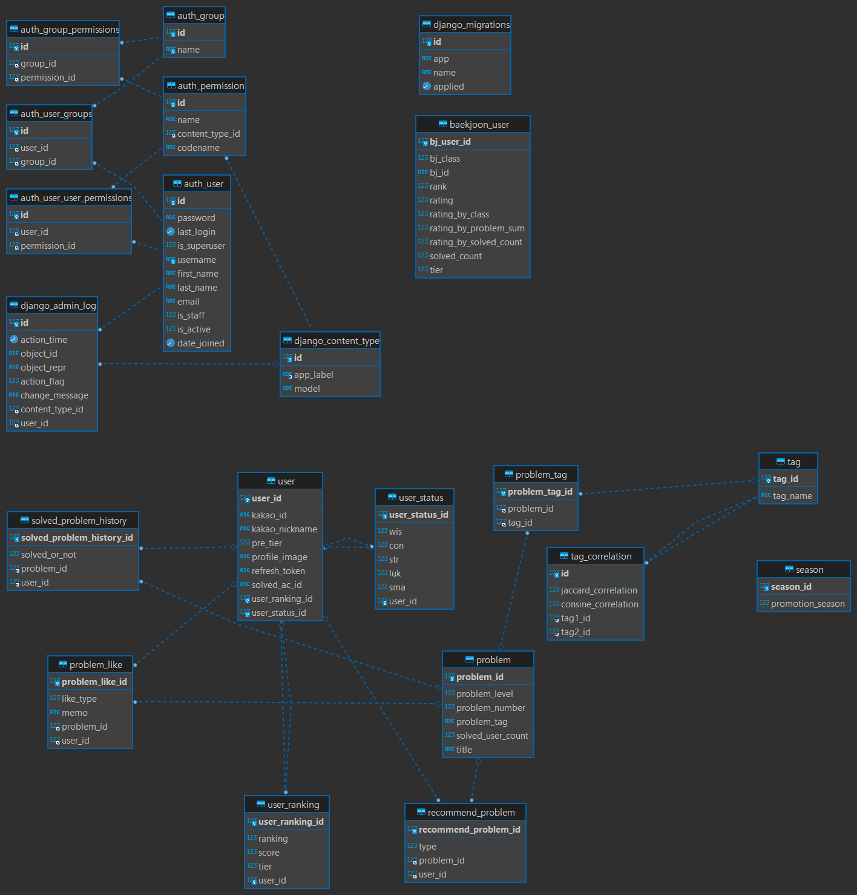

# 포팅 메뉴얼

# 사용 프로그램 버전

| Spring boot | 3.13 |
| --- | --- |
| Java | 17 |
| MariaDB | 10.11.5 |
| gradle | 8.2.1 |
| Redis | 7.2 |
| Docker | 24.0.6 |
| Jenkins | 2.424 |
| Android Studio Flamingo | 2022.2.1 Patch 2 |
| python | 3.9.13 |
| django | 4.2.5 |

# CI/CD 배포

```jsx
Nginx version 1.18.0
pem.key 로컬에 받아서 ssh 접근
ssh -i I9D204T.pem
[ubuntu@i9d204.p.ssafy.io](mailto:ubuntu@i9d210.p.ssafy.io) or MobaxTerm
이용해서 접속 (추천)
```

### 기본 방화벽 설정

1. 처음 ufw 설정 시 실수로 ssh 접속이 안되는 경우를 방지하기 위해
ssh 터미널을 여유있게 2~3 개 연결해 놓는다.
2. ufw 상태 확인

```jsx
$ sudo ufw status
Status : inactive
```

1. 사용할 포트 허용하기 (ufw inactive 상태)

```jsx
$ sudo ufw allow 22
3-1 등록한 포트 조회하기 (ufw inactive 상태)
$ sudo ufw show added
Added user rules (see 'ufw status' for running firewall):
ufw allow 22
```

1. ufw 활성화 하기

```jsx
$ sudo ufw enable
Command may disrupt existing ssh connections. Proceed with operation (y|n)?
y
4.1 ufw 상태 및 등록된 rule 확인하기
$ sudo ufw status numbered
Status: active
To Action From
[1] 22 ALLOW IN Anywhere
[2] 22 (v6) ALLOW IN Anywhere (v6)
```

5. 새로운 터미널을 띄워 ssh 접속해 본다.

```jsx
C:\\> ssh -i 팀.pem [ubuntu@팀.p.ssafy.io](mailto:ubuntu@xn--x87b.p.ssafy.io)
```

6. ufw 구동된 상태에서 80 포트 추가하기

```jsx
$ sudo ufw allow 80
6-1. 80 포트 정상 등록되었는지 확인하기
$ sudo ufw status numbered
Status: active
To Action From
[ 1] 22 ALLOW IN Anywhere
[ 2] 80 ALLOW IN Anywhere
[ 3] 22 (v6) ALLOW IN Anywhere (v6)
[ 4] 80 (v6) ALLOW IN Anywhere (v6)
6-2. allow 명령을 수행하면 자동으로 ufw 에 반영되어 접속이 가능하다.
```

7. 등록한 80 포트 삭제 하기

```jsx
$ sudo ufw status numbered
Status: active
To Action From
[ 1] 22 ALLOW IN Anywhere
[ 2] 80 ALLOW IN Anywhere
[ 3] 22 (v6) ALLOW IN Anywhere (v6)
[ 4] 80 (v6) ALLOW IN Anywhere (v6)
```

7-1. 삭제할 80 포트의 [번호]를 지정하여 삭제하기

```jsx
번호 하나씩 지정하여 삭제한다.
$ sudo ufw delete 4
$ sudo ufw delete 2
$ sudo ufw status numbered (제대로 삭제했는지 조회해보기)
Status: active
To Action From
[ 1] 22 ALLOW IN Anywhere
[ 2] 22 (v6) ALLOW IN Anywhere (v6)
```

7-2 (중요) 삭제한 정책은 반드시 enable 을 수행해야 적용된다.

```jsx

$ sudo ufw enable
Command may disrupt existing ssh connections. Proceed with operation (y|n)?
y 입력
도커 깔기
sudo apt install [docker.io](http://docker.io/)
자바 깔기
//자바깔기
sudo apt install openjdk-17-j
젠킨스 이미지 도커에 받기 (9000 번 포트 예시) 9000 번 포트로
로컬에서 접속하면 8080 포트에서 돌려준다
//젠킨스이미지 도커에 깔기(9000 번 포트)
docker run -itd --name jenkins -p 9000:8080 jenkins/jenkins:lts-jdk11
도커이미지 확인
docker images
젠킨스 실행 관련
```

# Jenkins Build

1. Nginx

```jsx
sudo apt update
sudo apt upgrade
sudo apt install nginx
sudo service nginx start
sudo service nginx status

설정 파일 열기
sudo vim /etc/nginx/sites-enabled/default
include /etc/nginx/conf.d/service-url.inc;
proxy_pass $service_url;
+) proxy_pass 위에 try files... 는 주석 처리하자.
+) 맨 위 두줄에서 listen 옆에 있는 포트를 변경하면서 기본 포트를 바꿀 수도 있다.

Nginx url 설정
service-url.inc 파일을 추가한다
sudo vim /etc/nginx/conf.d/service-url.inc
해당 파일에 다음 한 줄을 추가한다. 설정 추가 시, nginx 가 자동으로 8090포트에 포워딩을
해준다.
즉, 기본 포트(80)으로 접속시 자동으로 8090 포트에 연결되는 것이다.
set $service_url [http://127.0.0.1:](http://127.0.0.1:9001/)8090
nginx 재시작
sudo service nginx restart

배포를 위한 [deploy.sh](http://deploy.sh/), Dockerfile 작성
[deploy.sh](http://deploy.sh/)
Dockerfile
```

1. Jenkins

```jsx
실행
sudo systemctl start jenkins

종료
sudo systemctl stop jenkins

재시작
sudo systemctl restart jenkins

상태 체크
sudo systemctl status Jenkins
젠킨스 제대로 실행되는지 확인
기본적으로 Jenkins 를 처음 설치하면 8080 포트가 기본으로 설정되어
있는데, 필요하다면 포트 변경이 필요
sudo vi /etc/default/jenkins
위와 같이 설정하고 재시작을 해도 여전히 8080 포트로 설정되어있을 경우에는
jenkins.service 파일에 JENKINS_PORT 환경변수를 변경해줘야한다.

jenkins 상태체크 시 확인된 jenkins.service 파일의 위치를 vim 에디터로 실행
후 JENKINS_PORT 변경
```

# Django Project Build

```jsx
cd /algo_MR/
ubuntu@ip-172-26-0-255:~$ python3 --version
Python 3.8.10
ubuntu@ip-172-26-0-255:~$ pip3 --version
pip 20.0.2 from /usr/lib/python3/dist-packages/pip (python 3.8)

sudo apt update
sudo apt install python3 python3-pip //파이썬이 없다면 파이썬 설치

pip install -r requirements.txt

python3 [manage.py](http://manage.py/) migrate
python3 [manage.py](http://manage.py/) collectstatic --noinput
//장고를 실행하기 위해 호스트 허가를 해줘야한다.
// /home/ubuntu/algo_MR/algoarium/settings.py 내부의
ALLOWED_HOSTS = ['*']
// ['*']로 변경해준다.

python3 manage.py runserver 0.0.0.0:8000
//python 런서버 로 실행시켜줍니다.
```

# MariaDB Build

```jsx
sudo docker \
  run \
  --detach \
  --env MYSQL_ROOT_PASSWORD="ssafy" \
  --env MYSQL_USER=""  \
  --env MYSQL_PASSWORD="1234" \
  --env MYSQL_DATABASE="test" \
  --name "root" --publish 3306:3306 \
  mariadb:10.11.5;
```



# SpringProject Build

```
$ cd back-end/ # algoarium 경로 이동
$ chmod +x ./gradlew # gradlew 실행 권한 부여$ ./gradlew clean
$ ./gradlew build -x test # jar file 빌드
$ docker rmi -f back-end|| exit 0 # 기존 이미지 파일 삭제
$ docker build -t back-end. # 이미지 파일 빌드
```

# Android Build

### **# 안드로이드 앱 버전 업데이트 빌드 방법**

안드로이드 스튜디오 상에서, 앱의 버전을 업데이트하여 빌드하는 방법을 정리한다.

### **1. build.gradle(Module) 파일의 Version 정보 업데이트**

**1) 버전 정보 수정**

- versionCode: 기존 값보다 큰 정수 설정(1단위로 수정하면 된다)
- versionName: 기존 값보다 크게 X.X.X 형식으로 설정

**2) SyncNow 클릭**


### **2. 앱 빌드**

**1) Generate Signed Bundle/APK ... 클릭**


**2) AAB(Android App Bundle)가 선택된 상태에서 NEXT 클릭**


**3) Key Store와 key 의 비밀번호를 입력후, NEXT를 클릭한다**

- "Remember Passwrods" 는 가급적 체크하지 말자(자세한 내용은 아래 글 참고)

[[안드로이드 앱] AAB 빌드 안될 때 해결 방법: keystore password was incorrect, getSecretKey failed: Password is not ASCII](https://curryyou.tistory.com/404)


**4) release 가 선택된 상태에서 Finish 클릭**


**5) AAB 파일 확인**

- 프로젝트폴더 > app > release 경로에 빌드된 AAB파일이 생성된다.


- 빌드 완료 후, Event Log 창에서 "locate"를 클릭하면 바로 해당 경로로 이동할 수 있다.

